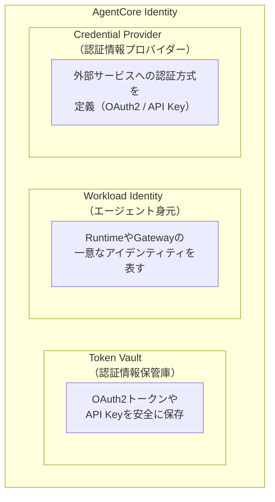
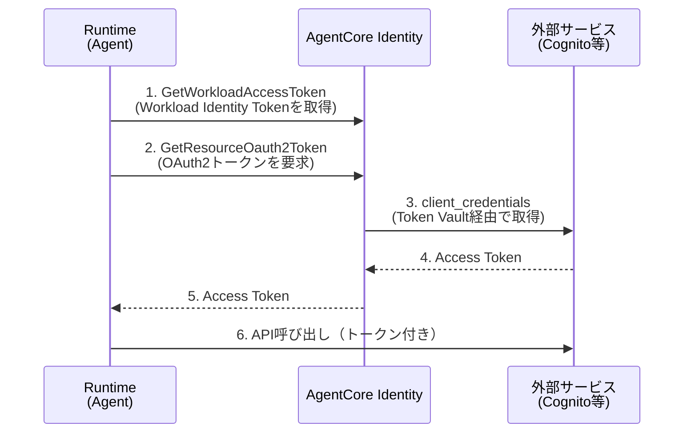
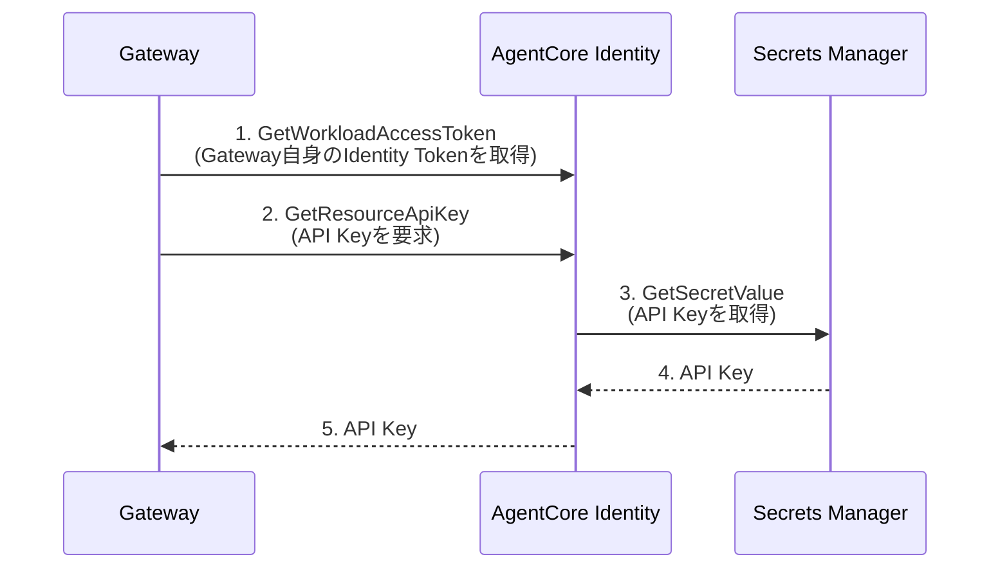

# エラー履歴メモ

## 2025-11-25: SchemaDefinition使用エラー

### エラー内容
```
プロパティ 'SchemaDefinition' は型 'typeof import("/Users/har1101/Documents/DevContainer_Workspace/project/serverless-agent-app/node_modules/@aws-cdk/aws-bedrock-agentcore-alpha/lib/index")' に存在していません。'SchemaDefinitionType' ですか?ts(2551)
```

**ファイル**: `lib/agentcore-gateway-stack.ts:39, 42`

### 原因
`SchemaDefinition`は**インターフェース（interface）**であり、クラスや関数ではありません。そのため、以下の使い方は誤りです：

- ❌ `agentcore.SchemaDefinition({...})` - 関数として呼び出し
- ❌ `new agentcore.SchemaDefinition({...})` - クラスとしてインスタンス化

ただし、[AWS CDK API Reference](https://docs.aws.amazon.com/cdk/api/v2/python/aws_cdk.aws_bedrock_agentcore_alpha/README.html#gateway)上の実装例では以下のようにクラスかのような扱いで記載されています。

```typescript
tool_schema = agentcore.ToolSchema.from_inline([
    name="hello_world",
    description="A simple hello world tool",
    input_schema=agentcore.SchemaDefinition(
        type=agentcore.SchemaDefinitionType.OBJECT,
        properties={
            "name": agentcore.SchemaDefinition(
                type=agentcore.SchemaDefinitionType.STRING,
                description="The name to greet"
            )
        },
        required=["name"]
    )
])
```

### 対処法

`SchemaDefinition`は単なる型定義（インターフェース）なので、オブジェクトリテラル`{}`として定義する必要があります。

**誤った使い方:**

```typescript
inputSchema: agentcore.SchemaDefinition({
    type: agentcore.SchemaDefinitionType.OBJECT,
    properties: {
        name: new agentcore.SchemaDefinition({
            type: agentcore.SchemaDefinitionType.STRING,
            description: 'ユーザー名'
        })
    }
})
```

**正しい使い方:**

```typescript
inputSchema: {
    type: agentcore.SchemaDefinitionType.OBJECT,
    properties: {
        name: {
            type: agentcore.SchemaDefinitionType.STRING,
            description: 'ユーザー名'
        }
    }
}
```

### 参考情報

- `SchemaDefinition`: TypeScriptのインターフェース型（型定義のみ）
- `SchemaDefinitionType`: enum型（STRING, NUMBER, OBJECT, ARRAY, BOOLEAN, INTEGER）
- 型定義ファイル: `node_modules/@aws-cdk/aws-bedrock-agentcore-alpha/agentcore/gateway/targets/schema/tool-schema.d.ts:43-77`

### 参考ドキュメント

- [AWS CDK Bedrock AgentCore](https://docs.aws.amazon.com/cdk/api/v2/python/aws_cdk.aws_bedrock_agentcore_alpha/README.html#gateway)
- [Medium: Deploying an Agent with AWS AgentCore using CDK](https://pjcr.medium.com/deploying-an-agent-with-aws-agentcore-using-cdk-060b54af0237)

---

## 2025-11-26: ContainerImageBuild と AgentRuntimeArtifact の型不一致エラー

### エラー内容
```
型 'ContainerImageBuild' には 型 'AgentRuntimeArtifact' からの次のプロパティがありません: bind, _render ts(2739)
```

**ファイル**: `lib/agentcore-runtime-stack.ts:20`

### 原因

`deploy-time-build`パッケージの`ContainerImageBuild`と、`@aws-cdk/aws-bedrock-agentcore-alpha`の`AgentRuntimeArtifact`は**異なるインターフェース**を持っています。

#### ContainerImageBuild（deploy-time-build）
CodeBuildを使ってデプロイ時にコンテナをビルドしECRにプッシュするL3 Construct。以下のプロパティを公開：
- `repository: IRepository` - ECRリポジトリ
- `imageTag: string` - イメージタグ
- `imageUri: string` - 完全なイメージURI

#### AgentRuntimeArtifact（aws-bedrock-agentcore-alpha）

AgentCore Runtimeに渡すコンテナイメージ設定を表す**抽象クラス**。以下のメソッドが必要：

- `bind(scope, runtime)` - パーミッション設定などの副作用を処理
- `_render()` - CloudFormation用のプロパティを生成

`ContainerImageBuild`はこれらのメソッドを実装していないため、直接渡すと型エラーになります。

#### 補足: `bind`と`_render`とは？

AWS CDKでは、リソース間の依存関係やパーミッションを管理するために**抽象クラス**のパターンがよく使われます。

**`bind(scope, runtime)`メソッドの役割:**

```
┌─────────────────────────────────────────────────────────────────┐
│  Runtime が作成されるとき                                        │
│                                                                 │
│  Runtime ──呼び出し──> AgentRuntimeArtifact.bind()              │
│                              │                                  │
│                              ▼                                  │
│                     「ECRリポジトリへの読み取り権限を                │
│                       RuntimeのIAMロールに付与する」              │
└─────────────────────────────────────────────────────────────────┘
```

- Runtimeがコンテナイメージを使うとき、ECRリポジトリからイメージをpullする権限が必要
- `bind()`が呼ばれると、必要なIAMポリシーが自動的に設定される
- 開発者が手動でパーミッションを書く必要がなくなる

**`_render()`メソッドの役割:**

```
┌─────────────────────────────────────────────────────────────────┐
│  CDK synth 実行時                                               │
│                                                                 │
│  AgentRuntimeArtifact._render()                                 │
│           │                                                     │
│           ▼                                                     │
│  {                                                              │
│    ContainerConfiguration: {                                    │
│      ContainerUri: "123456789.dkr.ecr.region.amazonaws.com/..." │
│    }                                                            │
│  }                                                              │
│           │                                                     │
│           ▼                                                     │
│  CloudFormationテンプレート (JSON/YAML) に変換                    │
└─────────────────────────────────────────────────────────────────┘
```

- CDKのコードをCloudFormationテンプレートに変換する処理
- `_render()`はCloudFormationが理解できる形式のオブジェクトを返す
- アンダースコア`_`は「内部メソッド（CDKフレームワークが呼び出す）」を意味する

**なぜ`fromEcrRepository()`を使うのか:**

`fromEcrRepository()`は、これらのメソッドを内部で実装済みの`AgentRuntimeArtifact`インスタンスを返します。つまり、開発者はECRリポジトリとタグを渡すだけで、残りの複雑な処理はCDKが自動で行ってくれます。

### 対処法

`AgentRuntimeArtifact.fromEcrRepository()`ファクトリメソッドを使って、`ContainerImageBuild`のプロパティを変換します。

**誤った使い方:**
```typescript
const agentcoreRuntimeImage = new ContainerImageBuild(this, 'Image', {
  directory: './assets',
  platform: Platform.LINUX_ARM64,
});

const runtime = new agentcore.Runtime(this, 'AgentCoreRuntime', {
  runtimeName: 'MyAgent',
  agentRuntimeArtifact: agentcoreRuntimeImage,  // ← エラー！
});
```

**正しい使い方:**
```typescript
const agentcoreRuntimeImage = new ContainerImageBuild(this, 'Image', {
  directory: './assets',
  platform: Platform.LINUX_ARM64,
});

const runtime = new agentcore.Runtime(this, 'AgentCoreRuntime', {
  runtimeName: 'MyAgent',
  agentRuntimeArtifact: agentcore.AgentRuntimeArtifact.fromEcrRepository(
    agentcoreRuntimeImage.repository,  // ECRリポジトリを渡す
    agentcoreRuntimeImage.imageTag     // イメージタグを渡す
  ),
});
```

### なぜこの方法が必要か

1. **型の互換性**: `fromEcrRepository()`は内部で`bind()`と`_render()`を実装した`AgentRuntimeArtifact`のインスタンスを返す
2. **パーミッション管理**: `AgentRuntimeArtifact`の`bind()`メソッドがECRリポジトリへのアクセス権限を自動設定
3. **CloudFormation生成**: `_render()`メソッドが正しいCloudFormationプロパティを生成

### 参考情報

- 型定義ファイル:
  - `node_modules/@aws-cdk/aws-bedrock-agentcore-alpha/agentcore/runtime/runtime-artifact.d.ts`
  - `node_modules/deploy-time-build/lib/container-image-build.d.ts`

### 参考ドキュメント

- [Zenn: Amazon Bedrock AgentCore 完全入門（追記セクション）](https://zenn.dev/aws_japan/articles/088f2051eb6ab3#%E8%BF%BD%E8%A8%98)
- [AWS CDK AgentCore Runtime Docs](https://docs.aws.amazon.com/cdk/api/v2/python/aws_cdk.aws_bedrock_agentcore_alpha/README.html#agentcore-runtime)

---

## 2025-11-28: Gateway自動作成CognitoのカスタムスコープをCDKから取得できない

### 問題内容

`agentcore.Gateway()`で`authorizerConfiguration`を省略した場合、Inbound Auth用のCognitoが自動作成（Quick Create）されます。このCognitoにはカスタムスコープが設定されますが、**CDKから直接取得する方法がありません**。

**ファイル**: `lib/agentcore-gateway-stack.ts`

### 原因

Quick Createで自動作成されるCognito（UserPool / App Client / Resource Server）は、**AgentCoreサービス側で作成される**ため、CloudFormationスタックのリソースとしては現れません。

- L2の`Gateway`クラスには、UserPool IDやResource Server IdentifierやCustom Scopeを返す属性が存在しない
- `gateway.userPool`や`gateway.userPoolClient`プロパティは存在するが、Quick Create使用時は`undefined`

### 対処法

カスタムスコープは**固定パターン**で作成されるため、決め打ちで組み立てます。

**スコープのパターン:**
```
${gatewayName}/genesis-gateway:invoke
```

**実装例:**
```typescript
const gatewayName = 'slack-agentcore-gateway';

const gateway = new agentcore.Gateway(this, 'SlackGateway', {
    gatewayName,
    // ... その他の設定
    // authorizerConfigurationを省略 → Quick Create
});

// カスタムスコープを決め打ちで組み立て
const cognitoScope = `${gatewayName}/genesis-gateway:invoke`;

// Runtimeの環境変数に渡す
const runtime = new agentcore.Runtime(this, 'AgentCoreRuntime', {
    // ... その他の設定
    environmentVariables: {
        COGNITO_SCOPE: cognitoScope,
    }
});
```

### 注意事項

- このパターンはAWS側で変更される可能性があるため、リリースノートの監視を推奨
- より厳密な管理が必要な場合は、Cognitoを自前で作成して`authorizerConfiguration`に渡す方法もある

### 参考情報

- カスタムスコープは Cognito の UserPool → アプリケーションクライアント → ログインページ から確認可能
- Resource Server Identifier: `${gatewayName}/genesis-gateway`
- Scope名: `invoke`

### 参考ドキュメント

- [AWS Cognito リソースサーバー](https://docs.aws.amazon.com/ja_jp/cognito/latest/developerguide/cognito-user-pools-define-resource-servers.html)

---

## 2025-11-29: Strands Agent ContentBlockの型エラー

### エラー内容

```
型 "ContentBlock" の引数を、関数 "format_content_block" の型 "dict[Unknown, Unknown]" のパラメーター "block" に割り当てることはできません
"ContentBlock" は "dict[Unknown, Unknown]" に割り当てできません
```

**ファイル**: `agent/agent.py`

### 原因

Strands Agentの`response.message['content']`の各要素は`ContentBlock`型（TypedDict）です。関数の引数を`dict`として定義すると、Pylanceが型の不一致を検出します。

### 対処法

`strands.types.content`から`ContentBlock`型をインポートして使用します。

**修正前:**

```python
def format_content_block(block: dict) -> str:
    ...
```

**修正後:**

```python
from strands.types.content import ContentBlock

def format_content_block(block: ContentBlock) -> str:
    ...
```

### ContentBlockの種類

`ContentBlock`はTypedDictで、以下のキーのいずれかを持ちます（`total=False`なのですべてオプション）：

| キー | 型 | 説明 |
|---|---|---|
| `text` | `str` | テキストコンテント |
| `toolUse` | `ToolUse` | ツール呼び出し要求（name, toolUseId, input） |
| `toolResult` | `ToolResult` | ツール実行結果（toolUseId, status, content） |
| `image` | `ImageContent` | 画像コンテント |
| `document` | `DocumentContent` | ドキュメントコンテント |
| `reasoningContent` | `ReasoningContentBlock` | モデルの推論内容 |

### Strands Agentのレスポンス構造

`agent(user_input)`の戻り値は`AgentResult`型です：

```python
@dataclass
class AgentResult:
    stop_reason: StopReason  # "end_turn" | "tool_use" | "max_tokens" など
    message: Message         # 最後のメッセージ
    metrics: EventLoopMetrics
    state: Any
    interrupts: Sequence[Interrupt] | None
    structured_output: BaseModel | None
```

`Message`の構造：

```python
class Message(TypedDict):
    content: List[ContentBlock]  # コンテントブロックの配列
    role: Role                   # "user" | "assistant"
```

### ContentBlockの表示実装例

```python
from strands.types.content import ContentBlock

def format_content_block(block: ContentBlock) -> str:
    """ContentBlockを読みやすい文字列に変換"""
    if 'text' in block:
        return block['text']
    elif 'toolUse' in block:
        tool = block['toolUse']
        return f"[ツール呼出] {tool['name']} (入力: {tool.get('input', {})})"
    elif 'toolResult' in block:
        result = block['toolResult']
        status = result.get('status', 'unknown')
        content = result.get('content', [])
        content_str = ', '.join(
            c.get('text', c.get('json', str(c))) if isinstance(c, dict) else str(c)
            for c in content
        )
        return f"[ツール結果] {status}: {content_str}"
    elif 'reasoningContent' in block:
        reasoning = block['reasoningContent']
        text = reasoning.get('reasoningText', {}).get('text', '')
        return f"[推論] {text[:100]}..." if len(text) > 100 else f"[推論] {text}"
    else:
        return str(block)

# 使用例
response = agent(user_input)
contents = response.message['content']

# すべてのContentBlockを整形して表示
for i, block in enumerate(contents):
    print(f"応答[{i}]: {format_content_block(block)}")

# テキストブロックのみを結合して返す
result = '\n'.join(
    block['text'] for block in contents if 'text' in block
)
```

### 参考ドキュメント

- [Strands Agent Types API Reference](https://strandsagents.com/latest/documentation/docs/api-reference/types/)

## 2025-11-30: Gateway L2デフォルトCognitoはM2M認証に使用不可

### 問題内容

`agentcore.Gateway()`で`authorizerConfiguration`を省略した場合に自動作成されるCognitoは、**M2M（Machine-to-Machine）認証に必要な機能が不足**しています。

**ファイル**: `lib/agentcore-gateway-runtime-stack.ts`

### 確認された問題点

| 項目 | 期待値 | 実際 |
|------|--------|------|
| クライアントシークレット | あり（`generateSecret: true`） | **なし** |
| OAuthスコープ | カスタムスコープ（`${gatewayName}/genesis-gateway:invoke`） | **OpenID標準スコープのみ**（`openid`, `email`等） |
| OAuthフロー | `client_credentials`有効 | **インタラクティブログイン用のみ** |

### 原因

CDKドキュメントを調査した結果：

1. `authorizerConfiguration`を省略すると**Cognitoがデフォルトで自動作成**される
2. ただし`GatewayAuthorizer`で選択可能なのは：
   - `GatewayAuthorizer.usingCustomJwt(...)` - カスタムJWT
   - `GatewayAuthorizer.usingAwsIam()` - IAM認証
3. **デフォルトCognitoをカスタマイズするAPIは存在しない**

つまり、デフォルトCognitoは「人間がブラウザからログインする」PoC用途であり、M2M認証（Identity→Gateway連携）には使えません。

### 対処法

**Cognitoを自前で作成し、`GatewayAuthorizer.usingCustomJwt()`で接続する**のが現時点のベストプラクティスです。

#### 実装手順

```typescript
import * as cognito from 'aws-cdk-lib/aws-cognito';
import * as agentcore from '@aws-cdk/aws-bedrock-agentcore-alpha';

// 1. User Pool
const userPool = new cognito.UserPool(this, 'GatewayUserPool', {
    userPoolName: `${gatewayName}-userpool`,
    selfSignUpEnabled: false,
});

// 2. Resource Server + カスタムスコープ
// ※ ResourceServerScopeを先に定義（後述のscopesプロパティ問題を回避）
const invokeOAuthScope = new cognito.ResourceServerScope({
    scopeName: 'genesis-gateway:invoke',
    scopeDescription: 'Invoke AgentCore Gateway',
});

const resourceServer = userPool.addResourceServer('GatewayResourceServer', {
    identifier: gatewayName,
    scopes: [invokeOAuthScope],
});

const invokeScope = cognito.OAuthScope.resourceServer(
    resourceServer,
    invokeOAuthScope,
);

// 3. M2M用クライアント（client_credentials + secret）
const m2mClient = userPool.addClient('GatewayM2MClient', {
    generateSecret: true,
    oAuth: {
        flows: { clientCredentials: true },
        scopes: [invokeScope],
    },
});

// 4. discoveryUrlの構築
const discoveryUrl = `https://cognito-idp.${this.region}.amazonaws.com/${userPool.userPoolId}/.well-known/openid-configuration`;

// 5. Gateway作成（Custom JWT認証）
const gateway = new agentcore.Gateway(this, 'SlackGateway', {
    gatewayName,
    // ... protocolConfiguration等
    authorizerConfiguration: agentcore.GatewayAuthorizer.usingCustomJwt({
        discoveryUrl,
        allowedClients: [m2mClient.userPoolClientId],
    }),
});
```

#### CfnOutputの追加（Identity設定時に必要）

```typescript
new cdk.CfnOutput(this, 'CognitoUserPoolId', {
    value: userPool.userPoolId,
});
new cdk.CfnOutput(this, 'CognitoClientId', {
    value: m2mClient.userPoolClientId,
});
new cdk.CfnOutput(this, 'CognitoScope', {
    value: `${gatewayName}/genesis-gateway:invoke`,
});
```

### 注意事項

- クライアントシークレットはSecretsManagerに自動保存される（AWSコンソールまたはCLIで取得）
- `allowedClients`にはclient_idを指定（JWTの`aud`チェック用）
- Gateway側はJWTの検証のみ行い、スコープ自体はCognito側の権限管理用
- Identityの`requires_access_token(scopes=[...])`でスコープを要求するためにカスタムスコープが必要

### 参考ドキュメント

- [AWS CDK AgentCore Gateway](https://docs.aws.amazon.com/cdk/api/v2/python/aws_cdk.aws_bedrock_agentcore_alpha/README.html#gateway)
- [AWS Cognito リソースサーバー](https://docs.aws.amazon.com/ja_jp/cognito/latest/developerguide/cognito-user-pools-define-resource-servers.html)

---

## 2025-11-30: UserPoolResourceServer.scopesプロパティが存在しない

### エラー内容

```
プロパティ 'scopes' は型 'UserPoolResourceServer' に存在しません。
```

**ファイル**: `lib/self-cognito-gateway-runtime-stack.ts:43`

### 原因

`UserPoolResourceServer`クラスの型定義を確認したところ、`scopes`プロパティは**入力パラメータとしてのみ存在**し、**作成後のインスタンスには公開されていません**。

#### 型定義の確認（node_modules/aws-cdk-lib/aws-cognito/lib/user-pool-resource-server.d.ts）

```typescript
// 入力時のオプション（scopesあり）
export interface UserPoolResourceServerOptions {
    readonly identifier: string;
    readonly scopes?: ResourceServerScope[];  // ← 入力パラメータとしては存在
}

// 作成後のクラス（scopesなし）
export declare class UserPoolResourceServer extends Resource {
    readonly userPoolResourceServerId: string;  // ← scopesプロパティは公開されていない！
}
```

これはCDKの設計上の制限です。

### 対処法

`ResourceServerScope`を**事前に変数として定義**し、`addResourceServer()`と`OAuthScope.resourceServer()`の両方で同じオブジェクトを参照します。

**誤った使い方:**

```typescript
const resourceServer = userPool.addResourceServer('GatewayResourceServer', {
    identifier: gatewayName,
    scopes: [
        {
            scopeName: 'genesis-gateway:invoke',
            scopeDescription: 'Invoke AgentCore Gateway',
        },
    ],
});

// ❌ エラー: scopesプロパティは存在しない
const invokeScope = cognito.OAuthScope.resourceServer(
    resourceServer,
    resourceServer.scopes[0],
);
```

**正しい使い方:**

```typescript
// 1. スコープを先に定義
const invokeOAuthScope = new cognito.ResourceServerScope({
    scopeName: 'genesis-gateway:invoke',
    scopeDescription: 'Invoke AgentCore Gateway',
});

// 2. Resource Serverに渡す
const resourceServer = userPool.addResourceServer('GatewayResourceServer', {
    identifier: gatewayName,
    scopes: [invokeOAuthScope],
});

// 3. 同じスコープオブジェクトを参照
const invokeScope = cognito.OAuthScope.resourceServer(
    resourceServer,
    invokeOAuthScope,  // ← resourceServer.scopes[0] ではなく、定義済みのオブジェクトを使う
);
```

### 参考情報

- 型定義ファイル: `node_modules/aws-cdk-lib/aws-cognito/lib/user-pool-resource-server.d.ts`

### 参考ドキュメント

- [AWS CDK UserPoolResourceServer](https://docs.aws.amazon.com/cdk/api/v2/docs/aws-cdk-lib.aws_cognito.UserPoolResourceServer.html)

---

## 2025-11-30: AgentCore Runtime IAMロールへのGetResourceOauth2Token権限追加

### エラー内容

`GetResourceOauth2Token`アクションに対して2種類のリソースへのアクセス拒否が発生する。

**エラー1: Token Vault (ディレクトリ自体)**
```
AccessDeniedException: User: arn:aws:sts::***:assumed-role/...-AgentCoreRuntimeExecution-.../BedrockAgentCore-...
is not authorized to perform: bedrock-agentcore:GetResourceOauth2Token on resource:
arn:aws:bedrock-agentcore:ap-northeast-1:***:token-vault/default
```

**エラー2: Token Vault (OAuth2 Credential Provider)**
```
AccessDeniedException: User: arn:aws:sts::***:assumed-role/...-AgentCoreRuntimeExecution-.../BedrockAgentCore-...
is not authorized to perform: bedrock-agentcore:GetResourceOauth2Token on resource:
arn:aws:bedrock-agentcore:ap-northeast-1:***:token-vault/default/oauth2credentialprovider/gateway-credential-provider
```

**エラー3: Workload Identity Directory (ディレクトリ自体)**
```
AccessDeniedException: User: arn:aws:sts::***:assumed-role/...-AgentCoreRuntimeExecution-.../BedrockAgentCore-...
is not authorized to perform: bedrock-agentcore:GetResourceOauth2Token on resource:
arn:aws:bedrock-agentcore:ap-northeast-1:***:workload-identity-directory/default
```

**エラー4: Workload Identity (個別のIdentity)**
```
AccessDeniedException: User: arn:aws:sts::***:assumed-role/...-AgentCoreRuntimeExecution-.../BedrockAgentCore-...
is not authorized to perform: bedrock-agentcore:GetResourceOauth2Token on resource:
arn:aws:bedrock-agentcore:ap-northeast-1:***:workload-identity-directory/default/workload-identity/StrandsAgentWithGateway-xxxxx
```

**エラー5: Secrets Manager (クライアントシークレット取得)**
```
AccessDeniedException: The requested operation could not be completed.
You are not authorized to perform: secretsmanager:GetSecretValue
```

**ファイル**: `lib/gateway-with-self-cognito-stack.ts`

### 原因

AgentCore RuntimeがIdentity経由でOAuth2トークンを取得するには、以下5つのリソースへのアクセス権限が必要：

1. **Token Vault Directory**: ディレクトリ自体（`token-vault/default`）
2. **Token Vault Provider**: OAuth2 Credential Provider（`token-vault/default/oauth2credentialprovider/{providerName}`）
3. **Workload Identity Directory**: ディレクトリ自体（`workload-identity-directory/default`）
4. **Workload Identity**: Runtime自身の個別ワークロードIdentity（`workload-identity-directory/default/workload-identity/*`）
5. **Secrets Manager**: Cognitoクライアントシークレット（`bedrock-agentcore-identity!default/oauth2/{providerName}`）

デフォルトではこれらの権限は付与されていない。

### 対処法

RuntimeのIAMロールに5つのリソースへのアクセス権限を追加する。

```typescript
import * as iam from 'aws-cdk-lib/aws-iam';

// RuntimeのIAMロールにIdentity Token Vault へのアクセス権限を追加
// GetResourceOauth2Token: Identity経由でOAuth2トークンを取得するために必要
runtime.role.addToPrincipalPolicy(new iam.PolicyStatement({
    actions: ['bedrock-agentcore:GetResourceOauth2Token'],
    resources: [
        // Token Vault (ディレクトリ自体)
        `arn:aws:bedrock-agentcore:${this.region}:${this.account}:token-vault/default`,
        // Token Vault (OAuth2 Credential Provider)
        `arn:aws:bedrock-agentcore:${this.region}:${this.account}:token-vault/default/oauth2credentialprovider/${providerName}`,
        // Workload Identity Directory (ディレクトリ自体)
        `arn:aws:bedrock-agentcore:${this.region}:${this.account}:workload-identity-directory/default`,
        // Workload Identity Directory (Runtime自身のIdentity)
        `arn:aws:bedrock-agentcore:${this.region}:${this.account}:workload-identity-directory/default/workload-identity/*`,
    ],
}));

// Secrets Manager へのアクセス権限（Cognito クライアントシークレット取得用）
// シークレット名: bedrock-agentcore-identity!default/oauth2/<providerName>
runtime.role.addToPrincipalPolicy(new iam.PolicyStatement({
    actions: ['secretsmanager:GetSecretValue'],
    resources: [
        `arn:aws:secretsmanager:${this.region}:${this.account}:secret:bedrock-agentcore-identity!default/oauth2/${providerName}-*`,
    ],
}));
```

### 注意: プロパティ名は `role` であり `executionRole` ではない

AgentCore Runtime L2 Constructでは、IAMロールのプロパティ名は**`role`**です。

```typescript
// ❌ 誤り
runtime.executionRole.addToPrincipalPolicy(...)

// ✓ 正しい
runtime.role.addToPrincipalPolicy(...)
```

他のCDK Construct（Lambda等）では`executionRole`という名前が使われることがあるため、混同しやすい。

### 必要なリソースARNパターン

| リソース | ARNパターン |
|----------|-------------|
| Token Vault Directory | `arn:aws:bedrock-agentcore:{region}:{account}:token-vault/default` |
| Token Vault Provider | `arn:aws:bedrock-agentcore:{region}:{account}:token-vault/default/oauth2credentialprovider/{providerName}` |
| Workload Identity Directory | `arn:aws:bedrock-agentcore:{region}:{account}:workload-identity-directory/default` |
| Workload Identity | `arn:aws:bedrock-agentcore:{region}:{account}:workload-identity-directory/default/workload-identity/*` |
| Secrets Manager | `arn:aws:secretsmanager:{region}:{account}:secret:bedrock-agentcore-identity!default/oauth2/{providerName}-*` |

### 参考情報

- `providerName`はIdentityコンソールで作成したResource Credential Provider名と一致させる必要がある
- Workload Identity名はRuntime名から自動生成される（例: `StrandsAgentWithGateway-xxxxx`）ため、ワイルドカード`*`を使用
- Token VaultとWorkload Identity Directoryの両方で、ディレクトリ自体（`/default`）と個別リソースの両方が必要
- Secrets Managerのシークレット名は `bedrock-agentcore-identity!default/oauth2/{providerName}` の形式
- [ワークロード ID ごとに認証情報プロバイダーへのアクセスを絞り込む](https://docs.aws.amazon.com/bedrock-agentcore/latest/devguide/scope-credential-provider-access.html)

---

## 2025-11-30: Cognito client_credentials フローでのトークン取得エラー

### エラー内容

```
ValidationException: Error parsing ClientCredentials response
```

### 原因

`client_credentials`フローでOAuth2トークンを取得するには、Cognitoの**トークンエンドポイント**（`https://<domain>.auth.<region>.amazoncognito.com/oauth2/token`）が必要。このエンドポイントは**Cognitoドメインを設定しないと使用できない**。

User Poolを作成しただけではドメインが設定されず、トークンエンドポイントが利用できないため、Identityがトークン取得に失敗する。

### 対処法

User Poolにドメインを追加する。

```typescript
const userPool = new cognito.UserPool(this, 'GatewayUserPool', {
    userPoolName: `${gatewayName}-userpool`,
    selfSignUpEnabled: false,
});

// Cognitoドメイン（client_credentials フローのトークンエンドポイントに必要）
userPool.addDomain('GatewayUserPoolDomain', {
    cognitoDomain: {
        domainPrefix: `${gatewayName}-${this.account}`,
    },
});
```

### 注意事項

- ドメインプレフィックスはグローバルで一意である必要がある
- `gatewayName`と`accountId`を組み合わせることで一意性を確保
- ドメインを設定すると、トークンエンドポイントは `https://<domainPrefix>.auth.<region>.amazoncognito.com/oauth2/token` となる

### 参考ドキュメント

- [The token issuer endpoint - Amazon Cognito](https://docs.aws.amazon.com/cognito/latest/developerguide/token-endpoint.html)
- [Unable to get token using Cognito for client credentials flow | AWS re:Post](https://repost.aws/questions/QUrAGZgkOARnyZpkbFQ4Oy_g/unable-to-get-token-using-cognito-for-client-credentials-flow)

---

## 2025-11-30: Bedrock基盤モデル・Inference Profileへのアクセス権限不足

### エラー内容

```
AccessDeniedException: User: arn:aws:sts::***:assumed-role/...-AgentCoreRuntimeExecution-.../BedrockAgentCore-...
is not authorized to perform: bedrock:InvokeModelWithResponseStream on resource:
arn:aws:bedrock:ap-northeast-1:***:inference-profile/jp.anthropic.claude-haiku-4-5-20251001-v1:0
because no identity-based policy allows the bedrock:InvokeModelWithResponseStream action
```

### 原因

AgentCore RuntimeのIAMロールには、デフォルトでBedrock基盤モデルやInference Profileへのアクセス権限が付与されていない。Strands AgentがLLMを呼び出す際に権限不足エラーが発生する。

### 対処法

RuntimeのIAMロールにBedrock呼び出し権限を追加する。

```typescript
// Bedrock 基盤モデル・Inference Profile へのアクセス権限
runtime.role.addToPrincipalPolicy(new iam.PolicyStatement({
    actions: [
        'bedrock:InvokeModel',
        'bedrock:InvokeModelWithResponseStream',
    ],
    resources: [
        // 基盤モデル（東京・大阪）
        'arn:aws:bedrock:ap-northeast-1::foundation-model/*',
        'arn:aws:bedrock:ap-northeast-3::foundation-model/*',
        // Inference Profile（東京・大阪）
        `arn:aws:bedrock:ap-northeast-1:${this.account}:inference-profile/*`,
        `arn:aws:bedrock:ap-northeast-3:${this.account}:inference-profile/*`,
    ],
}));
```

### 必要なリソースARNパターン

| リソース | ARNパターン |
|----------|-------------|
| 基盤モデル | `arn:aws:bedrock:{region}::foundation-model/*` |
| Inference Profile | `arn:aws:bedrock:{region}:{account}:inference-profile/*` |

### 注意事項

- 基盤モデルのARNにはアカウントIDが含まれない（`::`の部分）
- Inference ProfileのARNにはアカウントIDが必要
- 必要なリージョンのみを指定することでセキュリティを確保（例: 東京`ap-northeast-1`、大阪`ap-northeast-3`）

---

## 2025-11-30: Gateway サービスロールのGetWorkloadAccessToken権限不足

### エラー内容

```
Failed to fetch outbound api key. Failed to get workload identity token - client error:
User: arn:aws:sts::***:assumed-role/...-AgentCoreGatewayServiceRo-.../gateway-session-...
is not authorized to perform: bedrock-agentcore:GetWorkloadAccessToken on resource:
arn:aws:bedrock-agentcore:ap-northeast-1:***:workload-identity-directory/default/workload-identity/{gatewayName}-xxxxx
because no identity-based policy allows the bedrock-agentcore:GetWorkloadAccessToken action
```

### 原因

GatewayがOutbound認証（外部APIへのAPI Key取得等）を行う際に、Workload Access Tokenを取得する必要がある。GatewayのサービスロールにはデフォルトでこのAPIの権限が付与されていない。

**RuntimeのIAMロール権限とは別のエラー**であることに注意。

### 対処法

Gatewayのサービスロール（`gateway.role`）にOutbound認証に必要な権限を追加する。

```typescript
// GatewayサービスロールにOutbound認証権限を追加
gateway.role.addToPrincipalPolicy(new iam.PolicyStatement({
    actions: [
        'bedrock-agentcore:GetWorkloadAccessToken',
        'bedrock-agentcore:GetResourceApiKey',
    ],
    resources: [
        // Workload Identity Directory（ディレクトリ自体）
        `arn:aws:bedrock-agentcore:${this.region}:${this.account}:workload-identity-directory/default`,
        // Workload Identity（Gateway固有）
        `arn:aws:bedrock-agentcore:${this.region}:${this.account}:workload-identity-directory/default/workload-identity/${gatewayName}-*`,
        // Token Vault（ディレクトリ自体）
        `arn:aws:bedrock-agentcore:${this.region}:${this.account}:token-vault/default`,
        // Token Vault（API Key Credential Provider）
        `arn:aws:bedrock-agentcore:${this.region}:${this.account}:token-vault/default/apikeycredentialprovider/*`,
    ],
}));

// GatewayサービスロールにSecrets Manager権限を追加（API Key取得用）
// シークレット名: bedrock-agentcore-identity!default/apikey/<apiKeyName>-<id>
gateway.role.addToPrincipalPolicy(new iam.PolicyStatement({
    actions: ['secretsmanager:GetSecretValue'],
    resources: [
        `arn:aws:secretsmanager:${this.region}:${this.account}:secret:bedrock-agentcore-identity!default/apikey/${apiKeyName}-*`,
    ],
}));
```

### RuntimeとGatewayの権限の違い

| ロール | プロパティ | 用途 |
|--------|-----------|------|
| Runtime実行ロール | `runtime.role` | エージェントがIdentity経由でOAuth2トークン取得、Bedrock呼び出し等 |
| Gatewayサービスロール | `gateway.role` | GatewayがOutbound認証でWorkload Access Token取得 |

### 必要なリソースARNパターン

| リソース | ARNパターン |
|----------|-------------|
| Workload Identity Directory | `arn:aws:bedrock-agentcore:{region}:{account}:workload-identity-directory/default` |
| Gateway Workload Identity | `arn:aws:bedrock-agentcore:{region}:{account}:workload-identity-directory/default/workload-identity/{gatewayName}-*` |
| Token Vault Directory | `arn:aws:bedrock-agentcore:{region}:{account}:token-vault/default` |
| API Key Credential Provider | `arn:aws:bedrock-agentcore:{region}:{account}:token-vault/default/apikeycredentialprovider/*` |
| Secrets Manager (API Key) | `arn:aws:secretsmanager:{region}:{account}:secret:bedrock-agentcore-identity!default/apikey/{apiKeyName}-*` |

### 参考ドキュメント

- [Set up outbound authorization for your gateway](https://docs.aws.amazon.com/bedrock-agentcore/latest/devguide/gateway-outbound-auth.html)
- [Get workload access token](https://docs.aws.amazon.com/bedrock-agentcore/latest/devguide/get-workload-access-token.html)

---

## AgentCore IAM権限の目的と動作原理（まとめ）

### AgentCore Identityのアーキテクチャ

AgentCore Identityは、エージェントが外部サービスに安全にアクセスするための認証基盤です。以下の3つのコンポーネントで構成されています。

```
┌────────────────────────────────────────────────────────────────────────────┐
│                         AgentCore Identity                                  │
├─────────────────────┬─────────────────────┬────────────────────────────────┤
│   Token Vault       │  Workload Identity  │   Credential Provider          │
│   (認証情報保管庫)    │   (エージェント身元)  │   (認証情報プロバイダー)         │
├─────────────────────┼─────────────────────┼────────────────────────────────┤
│ OAuth2トークンや     │ RuntimeやGatewayの  │ 外部サービスへの認証方式を       │
│ API Keyを安全に保存  │ 一意なアイデンティティ│ 定義（OAuth2 / API Key）        │
│                     │ を表す               │                                │
└─────────────────────┴─────────────────────┴────────────────────────────────┘
```

**Mermaid版:**



### 認証フローの概要

#### 1. Runtime → Identity → 外部サービス（OAuth2 M2M）

エージェントが `@requires_access_token` デコレータを使って外部APIにアクセスする場合：

```
┌─────────────┐      ┌─────────────────────┐      ┌───────────────────┐
│  Runtime    │      │  AgentCore Identity │      │  外部サービス      │
│  (Agent)    │      │                     │      │  (Cognito等)      │
└──────┬──────┘      └──────────┬──────────┘      └─────────┬─────────┘
       │                        │                           │
       │ 1. GetWorkloadAccessToken                          │
       │ (Workload Identity Tokenを取得)                    │
       │───────────────────────>│                           │
       │                        │                           │
       │ 2. GetResourceOauth2Token                          │
       │ (OAuth2トークンを要求)                              │
       │───────────────────────>│                           │
       │                        │                           │
       │                        │ 3. client_credentials     │
       │                        │ (Token Vault経由で取得)    │
       │                        │──────────────────────────>│
       │                        │                           │
       │                        │<──────────────────────────│
       │                        │ 4. Access Token           │
       │<───────────────────────│                           │
       │ 5. Access Token        │                           │
       │                        │                           │
       │ 6. API呼び出し（トークン付き）                       │
       │───────────────────────────────────────────────────>│
```

**Mermaid版:**



#### 2. Gateway → Identity → 外部API（Outbound認証）

Gatewayがターゲット（外部API）にアクセスする際のAPI Key取得：

```
┌─────────────┐      ┌─────────────────────┐      ┌───────────────────┐
│  Gateway    │      │  AgentCore Identity │      │  Secrets Manager  │
│             │      │                     │      │                   │
└──────┬──────┘      └──────────┬──────────┘      └─────────┬─────────┘
       │                        │                           │
       │ 1. GetWorkloadAccessToken                          │
       │ (Gateway自身のIdentity Tokenを取得)                │
       │───────────────────────>│                           │
       │                        │                           │
       │ 2. GetResourceApiKey                               │
       │ (API Keyを要求)                                    │
       │───────────────────────>│                           │
       │                        │                           │
       │                        │ 3. GetSecretValue         │
       │                        │ (API Keyを取得)           │
       │                        │──────────────────────────>│
       │                        │                           │
       │                        │<──────────────────────────│
       │                        │ 4. API Key                │
       │<───────────────────────│                           │
       │ 5. API Key             │                           │
```

**Mermaid版:**



### Runtime IAM権限の詳細

| 権限 | リソース | 目的 | 使用タイミング |
|------|----------|------|---------------|
| `bedrock-agentcore:GetResourceOauth2Token` | `token-vault/default` | Token Vaultディレクトリへのアクセス | OAuth2トークン取得時 |
| `bedrock-agentcore:GetResourceOauth2Token` | `token-vault/default/oauth2credentialprovider/{providerName}` | 特定のOAuth2 Credential Providerへのアクセス | OAuth2トークン取得時 |
| `bedrock-agentcore:GetResourceOauth2Token` | `workload-identity-directory/default` | Workload Identityディレクトリへのアクセス | Workload Access Token取得時 |
| `bedrock-agentcore:GetResourceOauth2Token` | `workload-identity-directory/default/workload-identity/*` | Runtime自身のWorkload Identityへのアクセス | Workload Access Token取得時 |
| `secretsmanager:GetSecretValue` | `secret:bedrock-agentcore-identity!default/oauth2/{providerName}-*` | Cognitoクライアントシークレットの取得 | client_credentials フロー実行時 |
| `bedrock:InvokeModel` | `foundation-model/*` | Bedrockモデルの呼び出し | LLM推論時 |
| `bedrock:InvokeModelWithResponseStream` | `foundation-model/*`, `inference-profile/*` | ストリーミングレスポンスでのモデル呼び出し | LLM推論時（ストリーミング） |

#### 必要になる場面

1. **`@requires_access_token` デコレータ使用時**
   ```python
   @requires_access_token(
       provider_name="gateway-credential-provider",
       scopes=["openid"],
       auth_flow="M2M",
   )
   async def call_external_api(*, access_token: str):
       # access_token を使って外部APIを呼び出す
       ...
   ```

2. **Strands Agent でLLMを呼び出す時**
   ```python
   from strands import Agent
   from strands.models import BedrockModel

   model = BedrockModel(model_id="anthropic.claude-3-sonnet-...")
   agent = Agent(model=model, tools=[...])
   response = agent("ユーザー入力")  # ← ここでInvokeModelWithResponseStream
   ```

### Gateway IAM権限の詳細

| 権限 | リソース | 目的 | 使用タイミング |
|------|----------|------|---------------|
| `bedrock-agentcore:GetWorkloadAccessToken` | `workload-identity-directory/default` | Workload Identityディレクトリへのアクセス | Outbound認証開始時 |
| `bedrock-agentcore:GetWorkloadAccessToken` | `workload-identity-directory/default/workload-identity/{gatewayName}-*` | Gateway自身のWorkload Identityへのアクセス | Outbound認証開始時 |
| `bedrock-agentcore:GetResourceApiKey` | `token-vault/default` | Token Vaultディレクトリへのアクセス | API Key取得時 |
| `bedrock-agentcore:GetResourceApiKey` | `token-vault/default/apikeycredentialprovider/*` | API Key Credential Providerへのアクセス | API Key取得時 |
| `secretsmanager:GetSecretValue` | `secret:bedrock-agentcore-identity!default/apikey/{apiKeyName}-*` | API Keyシークレットの取得 | API Key取得時 |

#### 必要になる場面

1. **GatewayターゲットにOutbound認証が設定されている場合**
   ```typescript
   const target = client.create_mcp_gateway_target({
       gateway: gateway,
       name: "ExternalApi",
       target_type: "openApiSchema",
       target_payload: { inlinePayload: JSON.stringify(openApiSpec) },
       credentials: {
           api_key: "...",
           credential_location: "HEADER",
           credential_parameter_name: "X-API-Key"
       }
   });
   ```

2. **Gatewayがツール呼び出しを処理する際**
   - ユーザーがGateway経由でツールを呼び出す
   - Gatewayがターゲット（Lambda、外部API等）にリクエストを転送
   - ターゲットにOutbound認証が必要な場合、GatewayがIdentityからAPI Keyを取得

### RuntimeとGatewayの権限の違い

```
┌────────────────────────────────────────────────────────────────────────────┐
│                           認証フローの違い                                  │
├────────────────────────────────────┬───────────────────────────────────────┤
│         Runtime (Agent)            │              Gateway                   │
├────────────────────────────────────┼───────────────────────────────────────┤
│ • エージェントコードから外部サービス  │ • GatewayサービスがターゲットAPI      │
│   にアクセスするためのOAuth2トークン │   にアクセスするためのAPI Key/OAuth2  │
│   を取得                           │   トークンを取得                       │
│                                    │                                       │
│ • @requires_access_token           │ • credentialProviderConfigurations    │
│   デコレータで使用                  │   でターゲットに設定                   │
│                                    │                                       │
│ • GetResourceOauth2Token           │ • GetWorkloadAccessToken              │
│   アクションを使用                  │ • GetResourceApiKey                   │
│                                    │   アクションを使用                     │
├────────────────────────────────────┼───────────────────────────────────────┤
│ IAMロール: runtime.role            │ IAMロール: gateway.role               │
│ (AgentCoreRuntimeExecution-...)    │ (AgentCoreGatewayServiceRo-...)       │
└────────────────────────────────────┴───────────────────────────────────────┘
```

### Secrets Managerシークレット名のパターン

AgentCore Identityが使用するシークレットは、特定の命名規則に従って作成されます。

| 認証タイプ | シークレット名パターン |
|-----------|----------------------|
| OAuth2 Credential | `bedrock-agentcore-identity!default/oauth2/{providerName}` |
| API Key Credential | `bedrock-agentcore-identity!default/apikey/{apiKeyName}` |

**注意**: シークレットARNには末尾にランダムなサフィックス（`-xxxxxx`）が付くため、IAMポリシーでは `-*` を付けてワイルドカード指定する必要があります。

```typescript
// 正しい指定
`arn:aws:secretsmanager:${region}:${account}:secret:bedrock-agentcore-identity!default/oauth2/${providerName}-*`

// 誤った指定（末尾のサフィックスがマッチしない）
`arn:aws:secretsmanager:${region}:${account}:secret:bedrock-agentcore-identity!default/oauth2/${providerName}`
```

### 参考ドキュメント

- [Identity Quickstart](https://aws.github.io/bedrock-agentcore-starter-toolkit/user-guide/identity/quickstart.md)
- [Runtime Permissions](https://aws.github.io/bedrock-agentcore-starter-toolkit/user-guide/runtime/permissions.md)
- [Gateway Quickstart](https://aws.github.io/bedrock-agentcore-starter-toolkit/user-guide/gateway/quickstart.md)
- [Identity API Reference](https://aws.github.io/bedrock-agentcore-starter-toolkit/api-reference/identity.md)